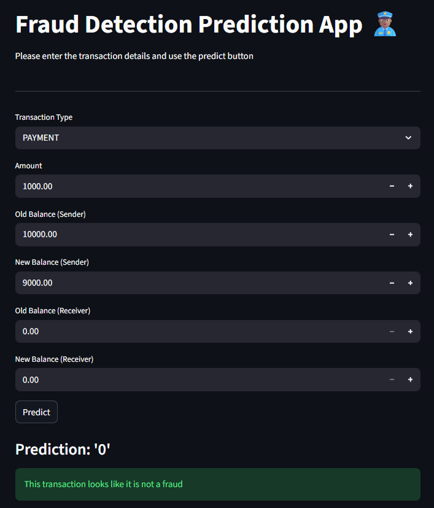

# 🛡️ FinGuard — Real-Time Transaction Fraud Detection

## 📌 Overview
Financial fraud causes significant losses for banks and fintech companies.  
**FinGuard** is an end-to-end data science project that detects fraudulent financial transactions by learning abnormal transaction patterns and delivering **real-time predictions** through a deployed web application.

This project demonstrates how fraud analytics systems are built and deployed in real-world environments.

---

## 🎯 Business Problem
Rule-based fraud detection systems struggle with:
- High false positives  
- Poor adaptability to evolving fraud patterns  

**Objective:**  
Build a scalable, data-driven fraud detection solution that accurately flags suspicious transactions while supporting real-time decision-making.

---

## 🧠 Solution Approach
- Cleaned and preprocessed historical transaction data  
- Engineered balance-difference and transaction-type risk features  
- Trained and evaluated a supervised classification model for fraud detection  
- Built a production-style ML pipeline for consistent inference  
- Deployed an interactive Streamlit application for real-time predictions  

---

## 🚀 Application Preview
The Streamlit app allows users to:
- Enter transaction details  
- Instantly receive a fraud prediction  
- Interpret results through clear success and warning messages  

---
